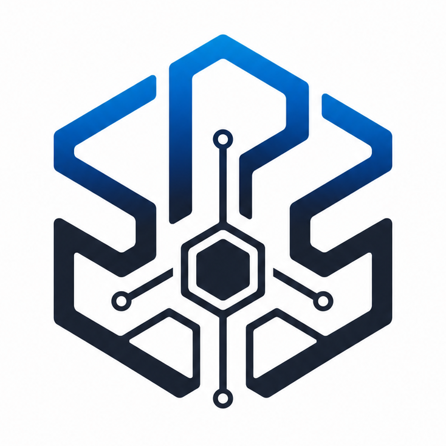

  

<h1 align="center">SPS</h1>

  <strong>팀에게 필요한 AI 작업환경을 직접 구성하세요.</strong>

  개인과 소규모 팀을 위한 로컬 우선·플러그인 기반 Windows Desktop 플랫폼

  <a href="https://redongames.com/sps/">제품 웹사이트</a>
  ·
  <a href="https://redongames.com/download/">SPS Desktop 다운로드</a>
  ·
  <a href="README.md">English</a>

> **비공개 피드백 베타:** SPS는 현재 개발 중이며 소수의 테스터를 대상으로
> 검증하고 있습니다. 중요한 작업은 반드시 별도로 백업해 주세요.

## SPS는 무엇인가요?

SPS(SonParkServer)는 AI 작업환경을 만들고 운영하는 Windows Desktop
플랫폼입니다. 모든 프로젝트에 같은 Task 보드, Room 구조, 역할 체계,
장기기억 방식, 개발 절차를 강요하지 않습니다.

SPS Core는 컴퓨터 연결, AI Runtime, 프로젝트 Source 접근, 실행 기록,
Artifact, 플러그인, 업데이트, 진단과 복구 기반을 담당합니다. 실제로 팀이
어떻게 일할지는 플러그인이 정의합니다.

따라서 같은 SPS를 게임 제작, 앱·웹 개발, 연구, 자동화 또는 완전히 새로운
작업 방식에 맞춰 구성할 수 있습니다.

## 왜 필요한가요?

기존 AI 도구는 대개 독립된 채팅이거나 작업 방식이 고정된 제품입니다.
하지만 실제 팀에는 그 중간이 필요합니다.

- 한 번 쓰고 사라지는 대화가 아닌 지속되는 프로젝트 맥락
- Codex 같은 CLI, 로컬 AI, 전문 API를 함께 쓰는 실행 환경
- 모든 프로젝트 파일을 SaaS에 올리지 않는 공동 작업공간
- 프로젝트 종류마다 다른 작업 구조
- 어떤 컴퓨터·AI·폴더·플러그인을 사용할지 정하는 명시적인 통제

SPS는 이 환경을 연결하고 관리하는 Control Plane입니다.

## 작동 방식

1. Host가 Windows 컴퓨터에서 SPS Workspace를 만듭니다.
2. Host가 Workspace에서 사용할 프로젝트 폴더와 AI Runtime을 지정합니다.
3. Member는 Tailscale을 통해 참여하고 자신의 컴퓨터에 있는 승인된 CLI나
   로컬 AI를 제공할 수 있습니다.
4. 플러그인이 Room, Task, 역할, 장기기억, 승인 방식, 전문 도구 등 실제
   작업 구조를 추가합니다.
5. SPS Desktop에서 실행 상태, 결과물과 기술 기록을 확인합니다.

일반 웹 브라우저는 Workspace 사용 경로가 아닙니다. SPS Desktop이 공식
제품 화면입니다.

## Core와 플러그인의 경계

| SPS Core가 제공하는 것 | 플러그인이 정하는 것 |
| --- | --- |
| Desktop Host와 Member 연결 | Room, Task, 보드, 보고 방식 |
| Workspace Source와 보호된 접근 경로 | Lead/Worker 또는 다른 역할 구조 |
| Runtime 조회와 실행 | 검토와 승인 흐름 |
| Run, Event, Artifact, Log, Job | 장기기억과 Compact 정책 |
| Secret, Storage, 진단, 업데이트 | 게임·앱·웹·연구 등 분야별 작업 방식 |
| 플러그인 검사, 호환성, 활성화, 업데이트, 롤백 | 분야별 도구와 UI |

Host와 Member는 기술적인 연결 역할입니다. 플러그인은 Core를 수정하지
않고도 사람과 AI의 업무 역할을 새로 만들 수 있습니다.

## 원하는 작업 방식으로 시작하기

새 Workspace는 중립 상태로 시작합니다. 기본으로 **Plugin Discovery &
Builder**가 활성화되고 Initial Assistant 한 명을 등록합니다. Assistant에게
원하는 환경을 설명해 Catalog를 찾거나, 공개 SDK로 개인 플러그인을 만들 수
있습니다.

플러그인 관리는 **Settings > Plugins**에서 이루어집니다. AI의 추천이나
초안만으로 플러그인이 자동 설치되지는 않습니다. 설치, 활성화, 업데이트,
롤백과 제거는 Host가 명시적으로 결정합니다.

## 비공개 베타 준비물

- Windows 10/11 x64
- 피드백 베타에 승인된 Google 계정
- 팀 연결에 사용할 각 컴퓨터의 Tailscale
- 지원되는 CLI, 로컬 AI 또는 API 기반 Agent 한 개 이상

현재 설치 파일과 안내는
[redongames.com/download](https://redongames.com/download/)에서 확인할 수
있습니다.

## 플러그인 개발

공개 [SPS Plugin SDK](https://github.com/Powerpunch777/sps-plugin-sdk)로
`.spsplugin` 패키지를 만들고 검사할 수 있습니다. 자신이 만든 플러그인은
공식 검토를 기다리지 않고 Local Development Registry에서 시험할 수
있습니다. Registry 신뢰와 플러그인 활성화는 Host가 결정합니다.

자세한 내용은 [플러그인 개발 안내](docs/PLUGIN-DEVELOPMENT.md)를 참고하세요.

## 현재 상태

Windows Desktop, 로컬 Host, Workspace Source, Host/Member/Node 연결,
Runtime 실행, 플러그인 생명주기와 호환성 검사, Local Development Registry,
데이터 내보내기 기반, 자동 업데이트 구조가 구현되어 있습니다.

첫 완성형 출시에 앞서 Host Import와 복구, 격리된 Plugin Preview, 검증된
Marketplace 화면, Windows 코드 서명, 실제 두 컴퓨터 반복 검증을 진행하고
있습니다.

제품 문의, 베타 참여, 협업 제안과 비공개 보안 신고는
[redongames1234@gmail.com](mailto:redongames1234@gmail.com)으로 보내주세요.

## 공개 범위

이 저장소는 제품 소개와 피드백을 위한 저장소이며 SPS Core나 Desktop 소스를
포함하지 않습니다. Core는 비공개이고, 플러그인 연결부와 개발 도구는
[SPS Plugin SDK](https://github.com/Powerpunch777/sps-plugin-sdk)에서
Apache-2.0 라이선스로 공개됩니다.

SPS 소프트웨어, 이름과 로고의 사용 권한은 이 저장소를 공개한 것만으로
부여되지 않습니다. 자세한 내용은 [NOTICE.md](NOTICE.md)를 참고하세요.

