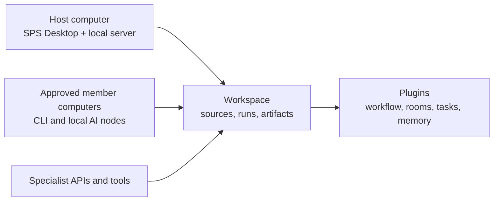

  

<h1 align="center">SPS</h1>

  <strong>Build the AI workspace your team actually needs.</strong>

  A local-first, plugin-based Windows Desktop platform for individuals and small teams.

  <a href="https://redongames.com/sps/">Product website</a>
  ·
  <a href="https://redongames.com/download/">Download SPS Desktop</a>
  ·
  <a href="README.ko.md">한국어</a>

> **Private feedback beta:** SPS is under active development and is currently
> intended for a small group of testers. Do not rely on a beta installation as
> the only copy of important work.

## What is SPS?

SPS (SonParkServer) is a Windows Desktop platform for building and operating
AI work environments. It gives a team a shared technical foundation without
forcing every project into the same Task board, Room layout, role hierarchy,
memory policy, or development method.

The SPS Core handles computers, AI runtimes, project-source access, execution
records, artifacts, plugins, updates, diagnostics, and recovery foundations.
Plugins define how a particular team works.

That separation lets the same SPS installation support a game-production
team, an app or web team, a research workflow, or a completely custom process.

## Why it exists

Most AI tools are either isolated chats or fixed workflow products. Real teams
need something between those extremes:

- durable project context instead of one disposable conversation;
- a choice of CLI agents, local AI, and specialist APIs;
- a shared workspace without uploading every project folder to a SaaS;
- different work structures for different kinds of projects;
- explicit control over which computer, runtime, source, and plugin may be used.

SPS is the control plane for that environment.

## How it works

1. A Host creates an SPS Workspace on a Windows computer.
2. The Host selects the project folders and AI runtimes the Workspace may use.
3. Members can join privately through Tailscale and contribute approved
   runtimes from their own computers.
4. Plugins add the actual working model: Rooms, Tasks, roles, memory,
   approvals, domain tools, or a different structure entirely.
5. Runs, artifacts, and technical events remain observable from SPS Desktop.

The Desktop app is the supported product surface. Direct browser access to a
Workspace is not part of the product flow.

## Core and plugins

| SPS Core provides | Plugins can define |
| --- | --- |
| Desktop Host and Member connection | Rooms, Tasks, boards, and reports |
| Workspace Sources and protected routes | Lead/Worker or another role model |
| Runtime discovery and dispatch | Review and approval behavior |
| Runs, events, artifacts, logs, and jobs | Long-term memory and compaction |
| Secrets, storage, diagnostics, and updates | Game, app, web, research, or custom workflows |
| Plugin inspection, compatibility, activation, update, and rollback | Domain-specific tools and UI |

Core connection roles such as Host and Member are technical roles. A plugin
may create its own human or AI work roles without changing the Core.

## Start with your workflow

A new Workspace starts neutral. It includes **Plugin Discovery & Builder** and
requires one Initial Assistant. You can describe the environment you want,
search the available catalog, or use the public SDK to build a private plugin.

Plugin management lives in **Settings > Plugins**. A recommendation or draft
does not silently change the Workspace. Installation, activation, update,
rollback, and removal remain explicit Host actions.

## Private beta requirements

- Windows 10 or Windows 11, x64
- a Google account approved for the current feedback beta
- Tailscale on each computer used for Host/Member collaboration
- at least one supported CLI, local AI runtime, or API-backed Agent

Download the current build and read the installation notes at
[redongames.com/download](https://redongames.com/download/).

## Build plugins

Plugin authors can use the public
[SPS Plugin SDK](https://github.com/Powerpunch777/sps-plugin-sdk) to create,
validate, package, inspect, and publish `.spsplugin` releases.

Personal plugins may be tested through a Local Development Registry without
waiting for official review. The Host still approves the registry and plugin
lifecycle. Official plugins are distributed through the signed
[SPS Official Extensions](https://github.com/Powerpunch777/SPS-Official-Extensions)
catalog.

Read [Plugin development](docs/PLUGIN-DEVELOPMENT.md) for the public extension
path.

## Current status

The Windows Desktop, local Host, Workspace Sources, technical Host/Member/Node
path, runtime dispatch, plugin lifecycle, compatibility checks, local
development registries, export foundation, and automatic update mechanism are
implemented.

The first complete release is still being hardened. Major release work
includes Host import and recovery, isolated plugin preview, the curated
marketplace interface, signed Windows distribution, and repeated
two-computer acceptance testing.

See [Product overview](docs/PRODUCT.md) and
[Getting started](docs/GETTING-STARTED.md) for more detail.

## Public repositories

- [SPS](https://github.com/Powerpunch777/SPS) — product overview and feedback
- [SPS Plugin SDK](https://github.com/Powerpunch777/sps-plugin-sdk) — public
  plugin authoring toolkit
- [SPS Official Extensions](https://github.com/Powerpunch777/SPS-Official-Extensions)
  — signed first-party extension catalog
- [SPS Desktop Releases](https://github.com/Powerpunch777/SPS-Desktop-Releases)
  — stable installer and update artifacts
- [Redon Games Website](https://github.com/Powerpunch777/redon-games-website)
  — studio and product website

SPS Core and SPS Desktop product source are private. The extension boundary is
public so developers can build plugins without receiving the proprietary
product source.

## Feedback and security

For beta access, product feedback, collaboration, or a private security
report, contact [redongames1234@gmail.com](mailto:redongames1234@gmail.com).

Do not post invitation codes, account details, credentials, private project
files, or unredacted logs in a public issue. See [SECURITY.md](SECURITY.md).

## Rights

This repository contains product documentation and SPS brand assets, not the
SPS product source code. No license to the SPS software, name, or logo is
granted by this repository. The public Plugin SDK has its own Apache-2.0
license. See [NOTICE.md](NOTICE.md).

